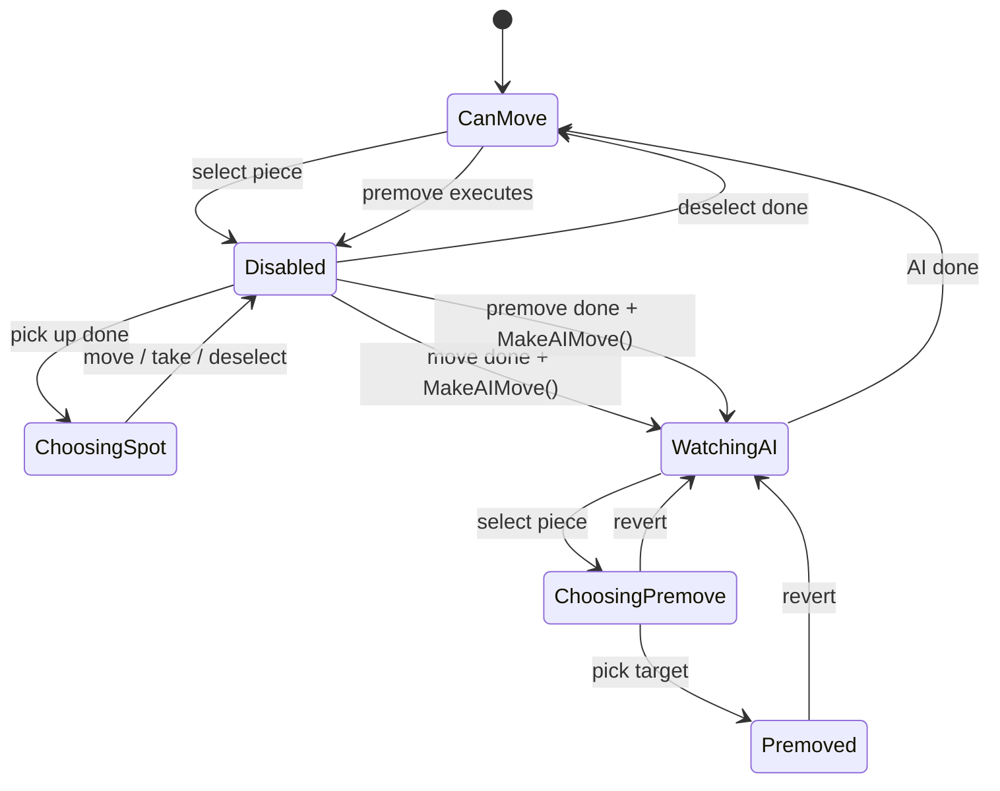

**CanMove** — The player's turn. Piece selection is enabled and any queued premove is executed and validated against the current board on entry.

**ChoosingSpot** — A piece is held in the player's hand. Legal move slots are visible on the board and the player is selecting a destination.

**Disabled** — An animation is in flight. All input is blocked. Transitions automatically to the next logical state when the animation completes.

**WatchingAI** — The AI's turn idle state. `MakeAIMove` runs in the background from whatever triggered this state. The player may queue a premove here. Premove state is cleared on entry.

**ChoosingPremove** — The player has selected a piece during the AI's turn. Legal moves are shown so the player can pick a target to queue.

**Premoved** — A move is queued and waiting for the AI's turn to finish. The player can cancel with escape, which returns to `WatchingAI` without triggering a new AI move.